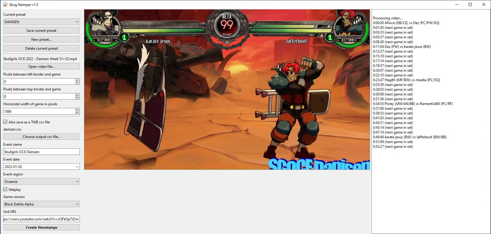

# Skug Stamper (GUI alpha)



Identifies sets of Skullgirls in videos using OCR and machine learning. Takes a
video file and figures out where each set starts, the names of each of the
players, and the teams that are being played. Tesseract picks up the usernames
of each player, while Tensorflow uses models trained against the character
portraits to determine which teams are being played.

Outputs a .csv file in [tunawithbacon](https://tunawithbacon.com/) format, and a
list of timestamps for use in YouTube video descriptions.

If you want to make changes/corrections to the csv and re-generate the
timestamps based off those corrections, use
[this tool](https://github.com/hugh-braico/twb-to-yt-timestamp).

## Limitations

1. Tightly coupled to Skullgirls's native colors. If your video is using filters
   that change the hue, contrast, brightness etc of the game, expect this to
   work very poorly if at all.
1. Assumes a 16:9 aspect ratio. The *canvas* can be different as long as the
   game itself is 16:9 (through the use of black bars, stream overlays, etc)
1. Does not currently support the alternate `-tourneyHUD` mode where usernames
   are displayed above health bars.
1. Only tested in English, you may need to install Tesseract language packs and
   do some light source code modification to the Tesseract calls to pick up 
   non-English characters.
1. Absolutely will not pick up names from stream overlays etc without heavy
   source code modification. Only designed for the native Steam username 
   display.
1. Unlikely to work well on low-quality video. Any lower than about 720p
   2500kbps and you may experience a high error rate (1080p 6000kbps is best).

## Setup

### Install dependencies

You will need to know your way around a command line to perform this setup.

* Install [Python](https://www.python.org/downloads/) 3.7+ (including the
  `pip` package manager)
* `git clone` this repo and `pip install -r requirements.txt`
* Install [Tesseract](https://github.com/tesseract-ocr/tessdoc) and make sure
  its binary is available on your PATH variable.
  * For Windows, I used
    [this installer by UB Mannheim](https://github.com/UB-Mannheim/tesseract/wiki#tesseract-installer-for-windows).

### Setting up usernames and aliases

Fill out `config/usernames.json` with the Steam usernames and actual names of
everyone who you expect to appear in the video. 

You have to write the names of *every* player, even if their Steam username and
actual name are the same. This is so the program can properly eliminate small 
errors introduced by the text recognition process by knowing exactly what 
usernames are correct. I realise this is a pain in the ass if you are running
into different players all the time, but unfortunately there isn't really a
better alternative.

Example:

```json
{
    "Silly steam username": "Real actual name",
    "|Decoy|ViiDream":      "ViiDream",
    "Bussy Destroya":       "Hemrock",
    "DEMACLIO":             "Dema",
    "SeaJay":               "SeaJay"
}
```

### Download your vod locally

Use [yt-dlp-interface](https://github.com/ErrorFlynn/ytdlp-interface), or
YouTube Studio / Twitch Video Manager if it's on your own channel.

It would be nice to be able to stream the video from YouTube directly without 
having to download it first, but I ran into too many issues with that approach,
sorry! Downloading the video locally is also much faster for repeat runs anyway
(eg. realising there is a username alias you forgot to fill out halfway through
the run).

### Launch skug-stamper

```bash
python main_gui.py
```

### Fill out options in left pane

Edit the values in config/presets.ini and fill in these values:

* GAME_X, GAME_Y, and GAME_SIZE : These tell the program where the game is on
  the canvas as well as how big it is. These are specified in pixels.


For full screen 720p video:

```
GAME_X = 0 
GAME_Y = 0
GAME_SIZE = 1280
```

* VERSION, EVENT, REGION, NETPLAY: These fill in values for the
  tunawithbacon-style csv file. If you're not interested in that and just
  want the timestamps, you can safely ignore these.

* DAY: If the preset's event always occurs on a certain day of the week, you
  can use this optional field to automatically infer the date. Eg. by putting
  Tuesday, it will use the most recent Tuesday including today. You can always
  manually specify the date with `-d YYYY-MM-DD`, which takes precedence (more
  on that later)

The values are separated into "sections" or "presets" which you can select when
running using `-p PRESET_NAME` (more on that later). If a preset doesn't have a
value specified, it will fall back on the DEFAULT value.

### Optional: GPU acceleration

In theory you can set up [GPU support](https://www.tensorflow.org/install/gpu) 
to make TensorFlow run faster. Make sure to follow the instructions carefully
(installing zlib, the CUDA toolkit, and CUDNN, as well as making all of them
available on PATH).

I'm not actually sure how much this helps. I haven't tested rigorously yet but 
GPU doesn't seem meaningfully faster. I have an AMD 3950X (16C/32T) and an RTX
2070S. I also haven't implemented good enough logging or display functionality
to show whether TensorFlow is even running on CPU or GPU.

## TODO

* .exe packaging / GUI - problems with tensorflow and/or tesseract.
    * Cope solution may be to package with python and a bash script to run it
* Support for `-tourneyHUD`
* Refactor to share functionality between gui and cmdline versions
* Performance profiling
* "Interactive mode" for offlines: prompt for usernames / "Same set" button
* be able to select multiple username.json files
