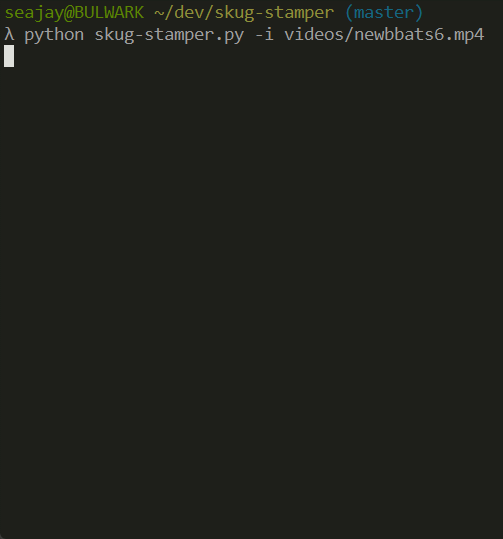
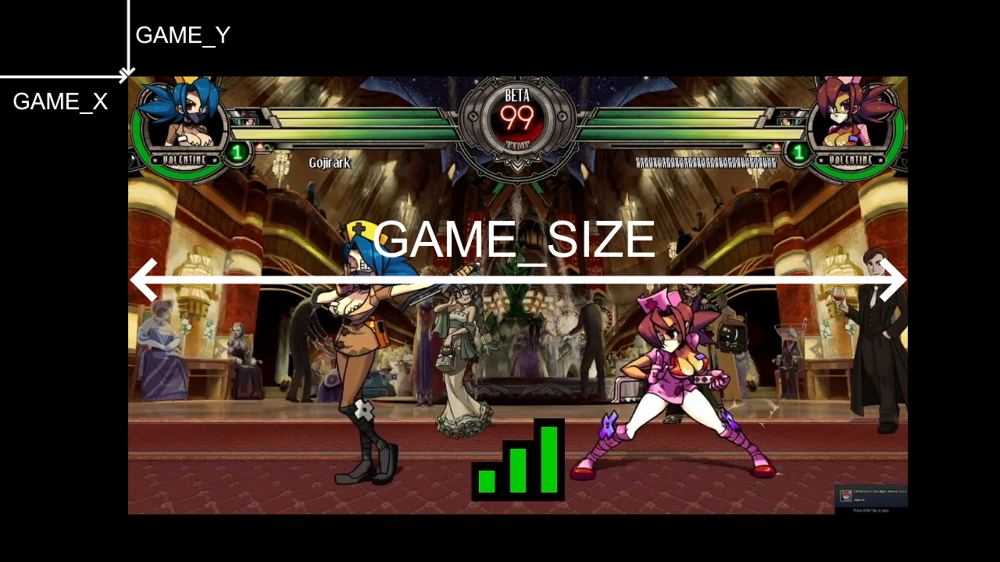
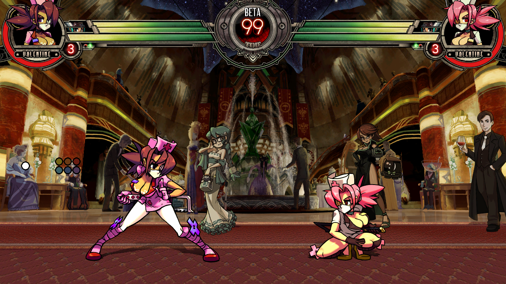
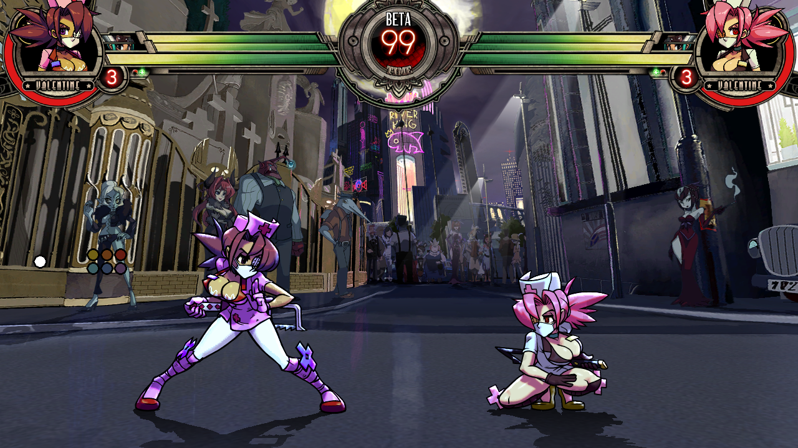
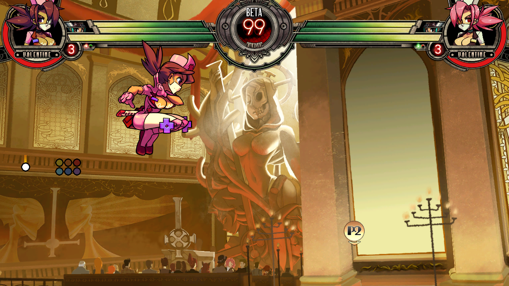

# Skug Stamper (alpha)



Identifies sets of Skullgirls in videos using OCR and machine learning. Takes a
video file and figures out where each set starts, the names of each of the
players, and the teams that are being played. 

Outputs a .csv file in [tunawithbacon](https://tunawithbacon.com/) format, and a
list of timestamps for use in YouTube video descriptions. The timestamps are 
automatically copied to your clipboard for you.

If you want to make changes/corrections to the csv and re-generate the
timestamps based off those corrections, use
[this tool](https://github.com/hugh-braico/twb-to-yt-timestamp).

## Limitations

1. Tightly coupled to Skullgirls's native colors. If your video is using filters
   that change the hue, contrast, brightness etc of the game, expect this to
   work very poorly if at all.
1. Assumes a 16:9 aspect ratio. The *canvas* can be different as long as the
   game itself is 16:9 (through the use of black bars, stream overlays, etc)
1. Does not currently support the alternate `-tourneyHUD` mode where usernames
   are displayed above health bars.
1. Only tested in English, you may need to install Tesseract language packs and
   do some light source code modification to the Tesseract calls to pick up 
   non-English characters.
1. Absolutely will not pick up names from stream overlays etc without heavy
   source code modification. Only designed for the native Steam username 
   display.
1. Unlikely to work well on low-quality video. Any lower than about 720p
   2500kbps and you may experience a high error rate (1080p 6000kbps is best)


## Setup

### Install dependencies

You will need to know your way around a command line to 

* install [Python](https://www.python.org/downloads/) 3.7+ 
  (including the `pip` package manager)
* `git clone` this repo and `pip3 install -r requirements.txt`
* Install [Tesseract](https://github.com/tesseract-ocr/tessdoc) and make sure
  its binary is available on your PATH variable.
* Optional: set up [GPU support](https://www.tensorflow.org/install/gpu) to make
  TensorFlow run faster. Make sure to follow the instructions carefully
  (installing zlib, the CUDA toolkit, and CUDNN, as well as making all of them
  available on PATH)

### Set up config.ini

Edit the values in config/presets.ini and fill in these values:

* GAME_X, GAME_Y, and GAME_SIZE : These tell the program where the game is on
  the canvas as well as how big it is. These are specified in pixels.



For full screen 720p video:

```
GAME_X = 0 
GAME_Y = 0
GAME_SIZE = 1280
```

* VERSION, EVENT, REGION, NETPLAY: These fill in values for the
  tunawithbacon-style csv file. If you're not interested in that and just
  want the timestamps, you can safely ignore these.

* DAY: If the preset's event always occurs on a certain day of the week, you
  can use this optional field to automatically infer the date. Eg. by putting
  Tuesday, it will use the most recent Tuesday including today. You can always
  manually specify the date with `-d YYYY-MM-DD`, which takes precedence (more
  on that later)

The values are separated into "sections" or "presets" which you can select when
running using `-p PRESET_NAME` (more on that later). If a preset doesn't have a
value specified, it will fall back on the DEFAULT value.

### Setting up usernames and aliases

Fill out config/usernames.json with the Steam usernames and actual names of
everyone who you expect to appear in the video. 

You have to write the names of *every* player, even if their Steam username and
actual name are the same. This is so the program can properly eliminate small 
errors introduced by the text recognition process by knowing exactly what 
usernames are correct. I realise this is a pain in the ass if you are running
into different players all the time, but unfortunately there isn't really a
better alternative.

Example:

```json
{
    "Silly steam username": "Real actual name",
    "|Decoy|ViiDream":      "ViiDream",
    "Bussy Destroya":       "Hemrock",
    "DEMACLIO":             "Dema",
    "SeaJay":               "SeaJay"
}
```

### Download your vod locally

You could do this using a tool like [yt-dlp](https://github.com/yt-dlp/yt-dlp) 
or [Twitch Leecher](https://github.com/Franiac/TwitchLeecher), or through 
YouTube Studio / Twitch Video Manager if it's on your own channel.

It would be nice to be able to stream the video from YouTube directly without 
having to download it first, but I ran into too many issues with that approach,
sorry! Downloading the video locally is also much faster for repeat runs anyway
(eg. realising there is a username alias you forgot to fill out halfway through
the run)

### Run the python script

Simplest possible invocation:

```bash
python3 skug-stamper.py -i vod.mp4
```

Other options:

```
  --input INPUT, -i INPUT       Input video filename
  --output OUTPUT, -o OUTPUT    Output csv file (default: out.csv)
  --preset PRESET, -p PRESET    Which presets.ini preset to use (default: DEFAULT)
  --url URL, -u URL             YouTube URL of your video
  --date DATE, -d DATE          Date the video was recorded (YYYY-MM-DD or DD/MM/YYYY)
  --event EVENT, -e EVENT       Name of the event (overrides presets.ini)
  --no-csv, -n                  Don't output a csv file, don't warn about missing parameters
  --only-sets, -s               Do not timestamp individual games, only sets of >=2 games
  --debug                       verbose logging, may output images to a debug/ folder
```

A typical invocation I might use to timestamp a newbbats video: 

```bash
python skug-stamper.py \
   -i ~/Downloads/newbbats4.mp4 \
   -o ~/Downloads/newbbats4.csv \
   -p NEWBBATS \
   -d 2022-01-27 \
   -u https://www.youtube.com/watch?v=KVXXd7tnFws
```

If it just hangs for a long time and never produces any output, double check
you've supplied your GAME_X, GAME_Y, and GAME_SIZE properly. It's probably just
looking at the wrong part of your video.

The program isn't going to get it right 100% of the time, give it a look to
make sure it looks right. Usernames that can't be identified are marked as \_.
The most common sources of \_'s is not having filled out your
`config/usernames.json` correctly. 

### Optional: OCR-friendly level backgrounds mod

If you have a copy of SkullMod and know how to use it, I have made a small
[level backgrounds mod](https://filedn.eu/laufS0q7iBOJLSpMDyM6Uxk/OCR%20friendly%20backgrounds%20mod.7z)
that makes it easier to OCR the names on some problematic stages without totally
butchering how the stage looks. This mod isn't necessary, but it will reduce
errors and increase speed (fewer errors means fewer retries). 

To install it, unpack your `levels-textures.gfs`, replace the files inside with
the files from the mod, then repack.

Glass Canopy: remove chandeliers and bright yellow "triangle" things, darken
background wall slightly



New Meridian: darken window on the right side



Cathedral: remove the stained glass window (Yeah I know, this doesn't look very
good. Apologies to the original artist)



## TODO

* .exe packaging / GUI - problems with tensorflow and/or tesseract.
    * Cope solution may be to package with python and a bash script to run it
* Support for `-tourneyHUD`
* Refactor to share functionality between gui and cmdline versions
* Performance profiling
* "Interactive mode" for offlines: prompt for usernames / "Same set" button